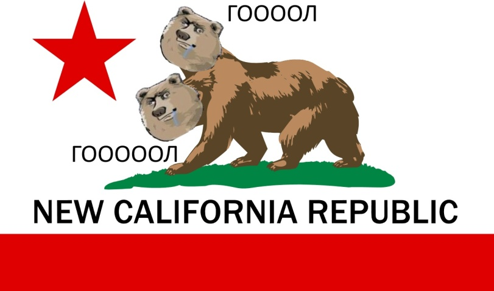

<div align="center">
    <h1>Булка!</h1>
    
</div>

Инструкция по сборке клиента/сервера:
---
Необходимые инструменты и пакеты для работы скриптов:
* GNU getopt
* jq
* [mrpack-install](https://github.com/nothub/mrpack-install)
* [packwiz](https://github.com/packwiz/packwiz)
* wget
* zip
```bash
# 1) Выбрать директорию вне папки модпака
# 2) Запустить скрипт находясь в ней
# Параметры:
# (опциональный) -m/--modpack <путь до модпака>
# (опциональный) -d/destination-folder <путь до папки назначения>
# -h/--help помощь, выводит эту справку

# Для клиента:
ПУТЬ_ДО_МОДПАКА/mkclient.sh <параметры>
# или для сервера:
ПУТЬ_ДО_МОДПАКА/mkserver.sh <параметры>

# Генерирует файлы необходимые для запуска клиента/сервера в папке dist
```

Ссылка на загрузку клиента (аккаунт не обязателен):
---
* [AstralPrism v9.0 (Windows)](https://github.com/DIDIRUS4/AstralPrism/releases/download/APF-v9.x/PrismLauncher-Windows-MinGW-w64-Setup-cab23e6-Debug.zip)

Ссылки на загрузку Java:
---
[Temurin JRE 17](https://github.com/adoptium/temurin17-binaries/releases/download/jdk-17.0.11%2B9/OpenJDK17U-jre_x64_windows_hotspot_17.0.11_9.msi)
